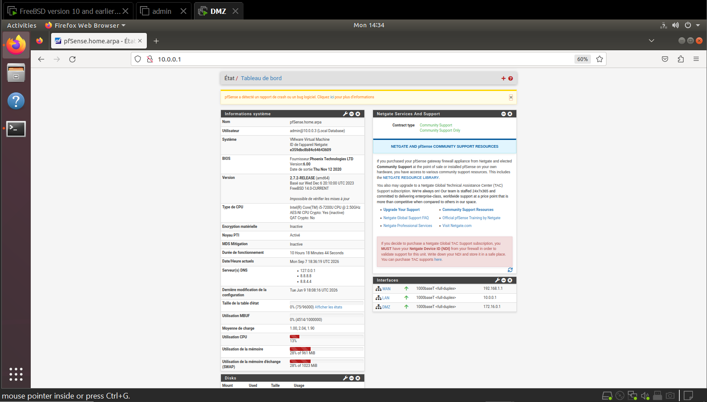
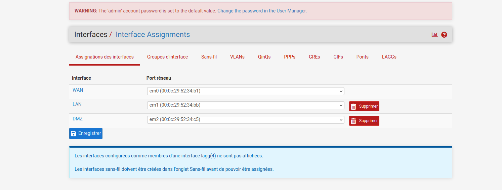
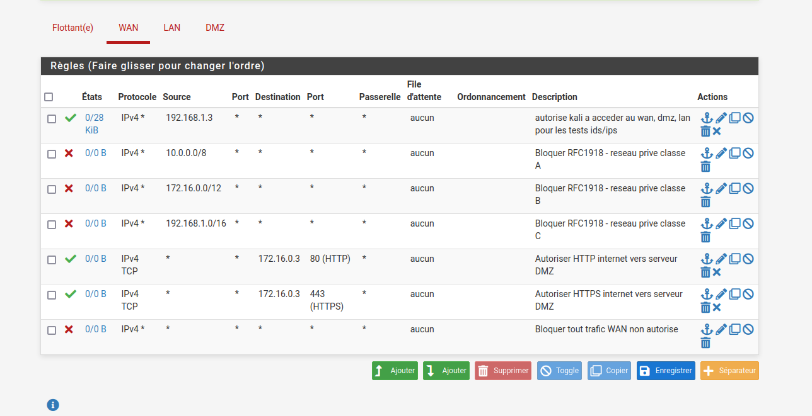
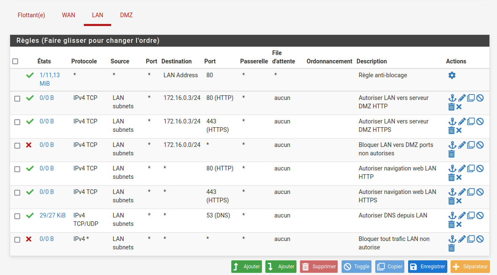
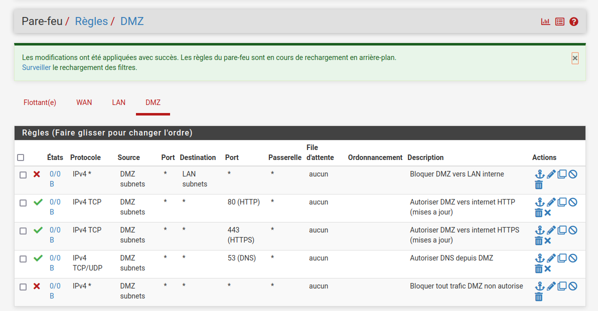
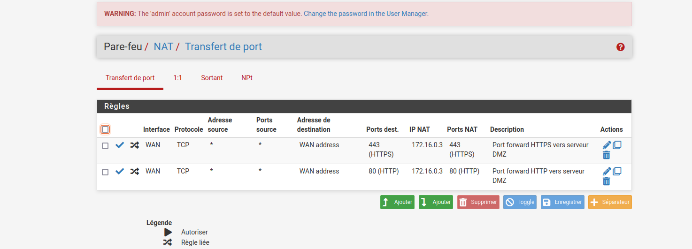
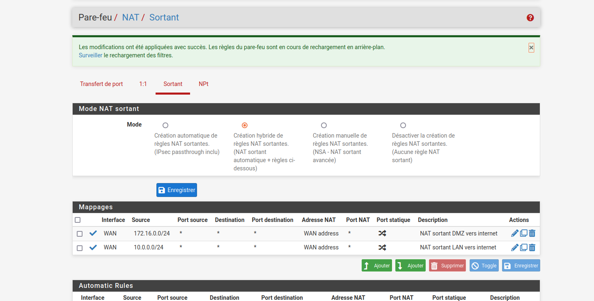
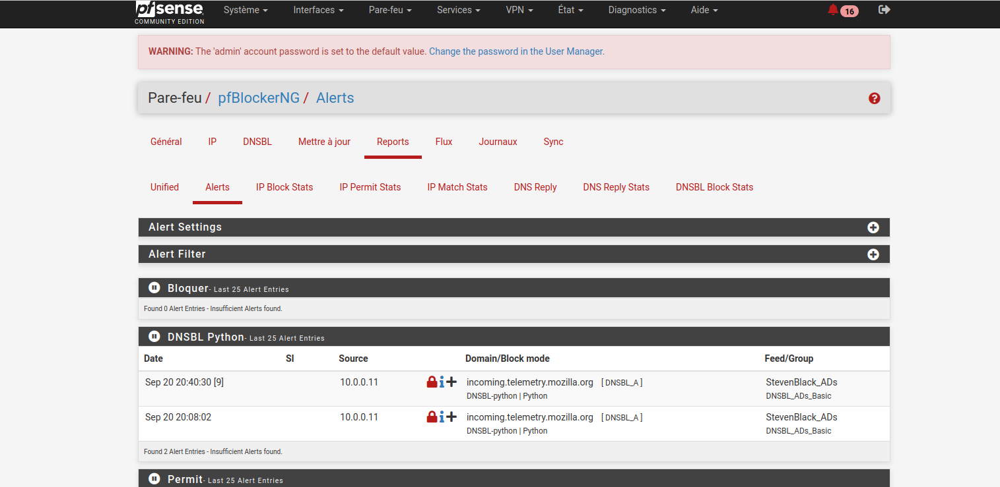
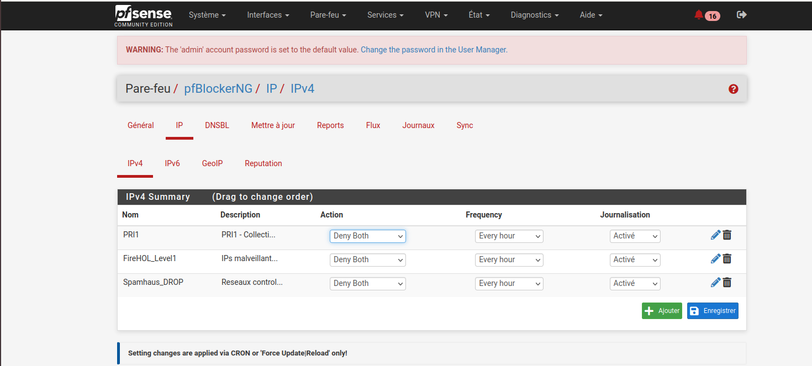
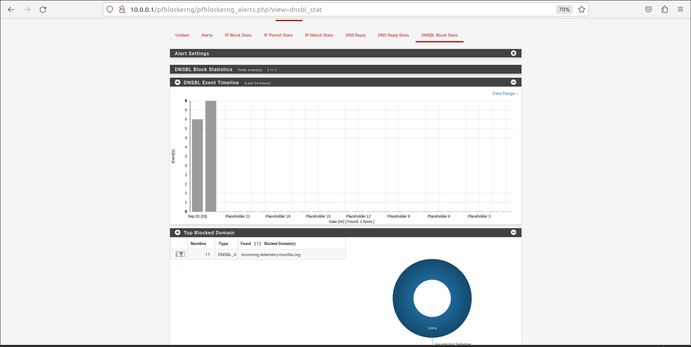

🛡️ pfSense Enterprise Firewall — TechCorp Sarl

Configuration complète d'un firewall d'entreprise avec pfSense pour TechCorp Sarl.
Architecture avec DMZ isolée, règles de filtrage avancées, NAT, détection d'intrusions
Suricata et blocage de 97 000+ menaces via pfBlockerNG.

🏗️ Architecture réseau

| Zone | Réseau | Rôle |
|---|---|---|
| WAN | 192.168.139.0/24 | Connexion internet |
| LAN | 10.0.0.0/24 | Réseau interne entreprise |
| DMZ | 172.16.0.0/24 | Serveurs exposés isolés |

⚙️ Technologies déployées

- **pfSense 2.7.2** — Firewall open source entreprise
- **Suricata IDS/IPS** — Détection et prévention d'intrusions sur WAN/LAN/DMZ
- **pfBlockerNG** — Blocage d'IPs malveillantes et filtrage DNS
- **VMware Workstation** — Virtualisation de l'infrastructure

🔐 Configuration Firewall

 Interfaces réseau

 Règles WAN — Contrôle du trafic entrant

✅ Autoriser Kali Linux (tests IDS/IPS)
❌ Bloquer RFC1918 classe A (10.0.0.0/8)
❌ Bloquer RFC1918 classe B (172.16.0.0/12)
❌ Bloquer RFC1918 classe C (192.168.0.0/16)
✅ Autoriser HTTP → serveur DMZ (172.16.0.3:80)
✅ Autoriser HTTPS → serveur DMZ (172.16.0.3:443)
❌ Bloquer tout trafic WAN non autorisé

 Règles LAN — Contrôle du réseau interne

✅ Règle anti-blocage (système)
✅ Autoriser LAN → DMZ port 80
✅ Autoriser LAN → DMZ port 443
❌ Bloquer LAN → DMZ tous autres ports
✅ Autoriser navigation HTTP depuis LAN
✅ Autoriser navigation HTTPS depuis LAN
✅ Autoriser DNS depuis LAN (port 53)
❌ Bloquer tout trafic LAN non autorisé

Règles DMZ — Isolation totale

❌ Bloquer DMZ → LAN (priorité absolue)
✅ Autoriser DMZ → internet port 80
✅ Autoriser DMZ → internet port 443
✅ Autoriser DNS depuis DMZ (port 53)
❌ Bloquer tout trafic DMZ non autorisé

🔄 Configuration NAT

### Port Forwarding — Accès serveur DMZ depuis internet

| Port        | Destination    | Description              |
| 80 (HTTP)   | 172.16.0.3:80  | Serveur web DMZ          |
| 443 (HTTPS) | 172.16.0.3:443 | Serveur web sécurisé DMZ |

NAT Sortant — Accès internet

| Source        | Interface | Description           |
| 10.0.0.0/24   | WAN       | NAT LAN vers internet |
| 172.16.0.0/24 | WAN       | NAT DMZ vers internet |

🔍 Suricata IDS/IPS

Suricata configuré en surveillance simultanée sur les 3 interfaces :

| Interface | Mode        | Description                   |
| WAN (em0) | Legacy Mode | Surveillance trafic entrant   |
| LAN (em1) | Legacy Mode | Surveillance réseau interne   |
| DMZ (em2) | Legacy Mode | Surveillance serveurs exposés |

🚫 pfBlockerNG — Blocage des menaces

 Résultats en temps réel

🛡️ IPs malveillantes bloquées  : 17 363
📛 Domaines DNSBL bloqués      : 80 169
⚡ Total menaces bloquées       : 97 532

Listes IP actives
Listes DNSBL actives

📊 Résultats obtenus

- ✅ Architecture 3 zones (WAN/LAN/DMZ) entièrement configurée
- ✅ Isolation totale DMZ → LAN implémentée
- ✅ Port Forwarding HTTP/HTTPS vers serveur DMZ
- ✅ Suricata actif en surveillance sur 3 interfaces
- ✅ 17 363 IPs malveillantes bloquées en temps réel
- ✅ 80 169 domaines malveillants et publicitaires bloqués
- ✅ Alertes DNSBL actives avec journalisation complète

🧠 Ce que j'ai appris

- Conception d'une architecture réseau d'entreprise avec DMZ isolée
- Logique de filtrage firewall — ordre des règles et principe du moindre privilège
- Configuration NAT entrant (Port Forwarding) et sortant (Outbound NAT)
- Intégration de Suricata directement dans pfSense
- Déploiement de pfBlockerNG pour la threat intelligence automatisée
- Différence entre blocage IP et blocage DNS (DNSBL)

👤 Auteur

**Franck Nkombou**
Étudiant RSI3 — École Supérieure Technique La Salle, Douala

